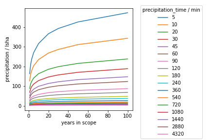

# KOSTRA DWD FTP tool

This is a small tool to simplify the daily work of engineers. There is already a great DWD API called [wetterdienst](https://github.com/earthobservations/wetterdienst) on github that provides minute weather data. However, for designing structures and other things, data from extreme weather events is necessary. These are available in the form of KOSTRA-DWD datasets on file exchange servers, for example as Excel documents.

This is great because it should be very time-consuming to extract extreme events from the DWD database using the API. Unfortunately, working with these datasets is very unintuitive and the data is in a form that is impractical for many calculations.

The present workflow is intended to remedy this. The individual steps (5 in total) are handled in a jupyter notebook (KOSTRA_DWD_FTP_tool.ipynb). The notebook format was used on purpose because its a great way to step into Python and programming in general. If want to use this as a Python import/package, let me know.

1) Searching the nearest weather stations via the wetterdienst API. Important information about each station is stored in an Excel file (ID_stations.xlsx each stations got its unique ID). Furthermore, the location of the station is visualised for counterchecking (ID_stations.png/pdf).

2) Retrieving/downloading and extracting the current KOSTRA files.

3) Searching the KOSTRA files for the desired information based on the ID of the previously found weather station.

4) Processing, visualization (ID_mm/lsha_surf/val/years.png/pdf) and saving of the found data in different units. 
mm = millimeters (ID_data_mm.xlsx). lsha = liters per second and hectares (ID_data_lsha.xlsx). 

5) Its your turn now. Use the notebook to automate your calculations... if your work is useful for other people let me know and ill add the functionalities ;)

